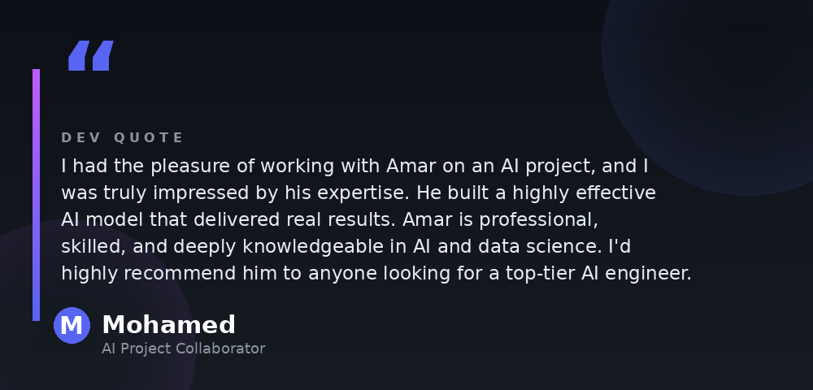

<!-- Header Wave -->
<div align="center">
  
</div>

<!-- Typing Animation -->
<div align="center">
  <a href="https://git.io/typing-svg">
    
  </a>
</div>

<!-- Social Badges -->
<div align="center">
  <a href="https://www.linkedin.com/in/amar-ahmed-hamed-25b676302">
    
  </a>
  <a href="https://www.kaggle.com/amarahmedhamed">
    
  </a>
  <a href="mailto:aammaarrah10@gmail.com">
    
  </a>
  
</div>

<br/>

<!-- About Me -->
##  About Me

```yaml
name: Amar Ahmed Hamed
location: Cairo, Egypt 🇪🇬
role: AI Engineer & Data Scientist
education: ITI - Artificial Intelligence Academy for Professionals
focus:
  - Machine Learning & Deep Learning
  - Reinforcement Learning (Model-Based RL, MCTS)
  - Computer Vision & NLP
  - LLMs, RAG & Agentic AI Systems
currently: Building multimodal AI agents that solve real-world problems
motto: "Research is only valuable when it ships."
```

- 🔭 Building **multimodal, tool-using AI agents** with hardened safety pipelines
- 🏆 **WiDS Global Datathon 2026 (Kaggle)** — Ranked **#34 Worldwide**
- 📄 Published Research: **AmarZero — Vision-Based RL Agent for Object Tracking & Planning**
- 🥇 Best Trainee @ **PathLine** & **GALACTIC PROBLEM SOLVER** Award
- 💬 Ask me about **RL, Computer Vision, LLMs, RAG, and Agentic Systems**

---

<!-- Tech Stack -->
## ⚡ Tech Stack

<div align="center">

### 🧠 AI / ML Frameworks


<br/>

### 💻 Languages & Data


<br/>

### 🛠️ Tools & DevOps


</div>

<div align="center">

#### 📚 AI & Data Libraries


#### 🤖 NLP, LLMs & Agentic AI


</div>

<div align="center">

`Machine Learning` `Deep Learning` `Reinforcement Learning` `Computer Vision` `NLP` `Transformers` `LLMs` `RAG & Fine-Tuning` `AI Agents & MCPs` `Data Analysis & EDA` `Feature Engineering` `Data Preprocessing`

</div>

---

<!-- Dev Quote -->
## 💬 Dev Quote

<div align="center">
  
</div>

> *"I had the pleasure of working with Amar on an AI project, and I was truly impressed by his expertise. He built a highly effective AI model that delivered real results. Amar is professional, skilled, and deeply knowledgeable in AI and data science. I'd highly recommend him to anyone looking for a top-tier AI engineer."*
>
> — **Mohamed** · AI Project Collaborator

---

<!-- Featured Projects -->
## 🚀 Featured Projects

<div align="center">

| 🧬 Project | 📝 Description | ⚙️ Tech |
|:--|:--|:--|
| **AmarZero** 📄 | Published research — Model-based RL agent for real-time object tracking & planning, outperforming traditional trackers | `ViT` `Kalman Filter` `MCTS` `RL` |
| **Health Guardian** 🏥 | Multimodal, tool-using medical safety agent with deterministic Safety Gate & 15 automated regression tests | `Gemma` `Agents` `Function Calling` |
| **QORAbot** 🛰️ | RAG-based NASA research chatbot with real-time, source-cited answers from official datasets | `RAG` `LLM` `Embeddings` |
| **Smart Healthmeror** 💊 | AI medical platform — prevention, diagnosis & monitoring with AmarZero tumor tracking | `Deep Learning` `ViT` `Web` |
| **Soccer Tactical Intelligence** ⚽ | 49-feature tactical framework across 9 clusters — pressing chains → shot creation | `SkillCorner` `Sequence Mining` `EDA` |
| **Sentiment Analysis App** 🐦 | From-scratch sentiment classifier on 1.6M tweets with interactive deployment | `TF-IDF` `Naive Bayes` `Gradio` |

</div>

---

<!-- Achievements -->
## 🏆 Achievements

<div align="center">

🥇 **WiDS Global Datathon 2026** — Ranked **#34 Worldwide** on Kaggle
📄 **Published Research** — AmarZero: Vision-Based RL Agent for Object Tracking
⭐ **Best Trainee** — PathLine Company
🌌 **GALACTIC PROBLEM SOLVER** Award
🎖️ **EliteBridge Award** Nominee

</div>

---

<!-- GitHub Stats -->
## 📊 GitHub Stats

<div align="center">
  
  
</div>

<div align="center">
  
</div>

<div align="center">
  
</div>

---

<!-- Footer -->
<div align="center">
  
</div>

<div align="center">
  <b>💜 Let's build intelligent systems that matter.</b><br/>
  <i>"Research is only valuable when it ships."</i>
</div>
