<!-- ⚡ ANIMATED AI HEADER — Neural network, particles, orbiting core -->
<div align="center">
  
</div>

<!-- Typing Animation -->
<div align="center">
  <a href="https://git.io/typing-svg">
    
  </a>
</div>

<!-- Social Badges -->
<div align="center">
  <a href="https://www.linkedin.com/in/amar-ahmed-hamed-25b676302">
    
  </a>
  <a href="https://www.kaggle.com/amarahmedhamed">
    
  </a>
  <a href="https://github.com/amarwahdan">
    
  </a>
  <a href="mailto:aammaarrah10@gmail.com">
    
  </a>
  
</div>


<!-- About Me -->
##  About Me

```yaml
name: Amar Ahmed Hamed
location: Cairo, Egypt 🇪🇬
role: AI Engineer & Data Scientist
education: ITI — Artificial Intelligence Academy for Professionals and Self Study
focus:
  - Agentic AI & Autonomous Security Agents
  - Reinforcement Learning (Model-Based RL, MCTS)
  - Computer Vision & NLP
  - LLMs, RAG & Fine-Tuning (LoRA / QLoRA)
currently: Building multimodal AI agents that solve real-world problems
```

- 🔭 Building **autonomous AI agents** — from offensive security testing to medical safety
- 🏆 **WiDS Global Datathon 2026 (Kaggle)** — Ranked **#34 Worldwide**
- 📄 Published Research: **AmarZero — Vision-Based RL Agent for Object Tracking & Planning**
- 🥇 Best Trainee @ **PathLine** · **GALACTIC PROBLEM SOLVER** · EliteBridge Award Nominee
- 💬 Ask me about **RL, Computer Vision, LLMs, RAG, and Agentic Systems**


<!-- Tech Stack -->
## ⚡ Tech Stack

<div align="center">

### 🧠 AI / ML Frameworks


### 💻 Languages & Data


### 🛠️ Tools & DevOps


</div>

<div align="center">

#### 📚 AI & Data Libraries


#### 🤖 NLP, LLMs & Agentic AI


</div>

<div align="center">

`Machine Learning` `Deep Learning` `Reinforcement Learning` `Computer Vision` `NLP` `Transformers` `LLMs` `RAG & Fine-Tuning` `AI Agents & MCPs` `Data Analysis & EDA` `Feature Engineering`

</div>


<!-- Featured Projects -->
## 🚀 Featured Projects

<div align="center">

| # | 🧬 Project | 📝 Description | ⚙️ Tech |
|:--|:--|:--|:--|
| 1 | **Mooox-Agent** 🛡️ | Autonomous AI agents that act like real hackers — run your code dynamically, find vulnerabilities & validate them with actual proof-of-concepts. Fast, accurate security testing without manual pentesting overhead or static-analysis false positives | `AI Agents` `Offensive Security` `Dynamic Analysis` |
| 2 | **Health Guardian** 🏥 | Multimodal, tool-using medical safety agent with deterministic Safety Gate & 15 automated regression tests | `Gemma` `Agents` `Function Calling` |
| 3 | **AmarZero** 📄 | Published research — Model-based RL agent for real-time object tracking & planning, outperforming traditional trackers | `ViT` `Kalman Filter` `MCTS` `RL` |
| 4 | **Soccer Tactical Intelligence** ⚽ | 49-feature tactical framework across 9 clusters — pressing chains → shot creation, validated on 10 A-League matches | `SkillCorner` `Sequence Mining` `EDA` |
| 5 | **QORAbot** 🛰️ | RAG-based NASA research chatbot with real-time, source-cited answers from official datasets | `RAG` `LLM` `Embeddings` |
| 6 | **Smart Healthmeror** 💊 | AI medical platform — prevention, diagnosis & monitoring with AmarZero tumor tracking | `Deep Learning` `ViT` `Web` |
| 7 | **Sentiment Analysis App** 🐦 | From-scratch sentiment classifier on 1.6M tweets with interactive deployment | `TF-IDF` `Naive Bayes` `Gradio` |

</div>


<!-- Dev Quote — ANIMATED CHAT -->
## 💬 Dev Quote

<div align="center">
  
</div>


<!-- Achievements -->
## 🏆 Achievements

<div align="center">

🥇 **WiDS Global Datathon 2026** — Ranked **#34 Worldwide** on Kaggle
📄 **Published Research** — AmarZero: Vision-Based RL Agent for Object Tracking
⭐ **Best Trainee** — PathLine Company
🌌 **GALACTIC PROBLEM SOLVER** Award
🎖️ **EliteBridge Award** Nominee

</div>


<!-- GitHub Stats -->
## 📊 GitHub Stats

<div align="center">
  
  
</div>

<div align="center">
  
</div>

<div align="center">
  
</div>

<div align="center">
  
</div>

<!-- 🐍 Contribution Snake — يشتغل بعد ما تفعّل الـ GitHub Action -->
<div align="center">
  <picture>
    <source media="(prefers-color-scheme: dark)" srcset="https://raw.githubusercontent.com/amarwahdan/amarwahdan/output/github-contribution-grid-snake-dark.svg"/>
    <source media="(prefers-color-scheme: light)" srcset="https://raw.githubusercontent.com/amarwahdan/amarwahdan/output/github-contribution-grid-snake.svg"/>
    
  </picture>
</div>

<!-- ⚡ ANIMATED FOOTER -->
<div align="center">
  
</div>
